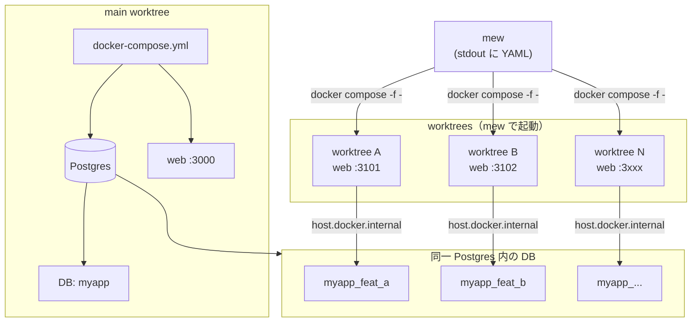

# mew — Multiple Environment Worktrees

**mew** は、Git worktree と Docker Compose を使った**並行開発**のための汎用 CLI です。  
複数ブランチを同時に動かしたいときに、worktree ごとに別ポート・別 DB の web 環境を立ち上げ、インフラ（Postgres など）は共有します。

---

## 目的

- **複数ブランチの同時稼働**: 1 リポジトリで、main と複数 worktree を同時に起動し、それぞれ別 URL・別 DB で開発・検証する
- **設定ファイル不要**: `.mew.yaml` 等は使わず、既存の `docker-compose.yml` と `git worktree list` から設定を推測する
- **どのプロジェクトでも使える**: Docker Compose で web + db を持つプロジェクトであれば、そのまま mew で worktree 並行開発ができる

---

## 概要

- **コマンド**: 単一の `mew` コマンドにサブコマンドで機能を提供（`mew build`, `mew up`, `mew compose` など）
- **配布**: 単一の Bash スクリプト + インストーラ（`install.sh`）。追加の設定ファイルは不要
- **前提**: `git` と `docker`（Docker Desktop 等）がインストールされていること
- **略称**: **M**ultiple **E**nvironment **W**orktrees

---

## 機能一覧

| サブコマンド | 説明 |
|--------------|------|
| `mew`（引数なし） | ヘルプ（サブコマンド一覧）を表示 |
| `mew build [branch...]` | 対話型で worktree を作成し、各 worktree で web を起動する（並行開発のメイン入口） |
| `mew up [path]` | 指定した worktree（省略時はカレント）の web を起動する（DB 作成・`MEW_MIGRATE_CMD` があれば実行） |
| `mew env` | 現在の worktree の DB 名・`DATABASE_URL` 等を出力する（`source` 用） |
| `mew compose [args...]` | この worktree 用の Compose プロジェクトで `docker compose` を実行する（`run` / `logs` / `exec` / `up` 等） |
| `mew rm` | この worktree の web 停止・DB 削除 |
| `mew rm --all` | 全 worktree の web 停止・DB 削除・worktree 削除（main で実行） |
| `mew restart` | main と全 worktree の web を再起動する |

---

## アーキテクチャ概要

mew は「main worktree」と「各 worktree」を区別し、main の `docker-compose.yml` で起動した **Postgres を 1 つ共有**し、worktree ごとに**別データベース**と**別ポートの web コンテナ**を割り当てます。worktree 用の compose 定義はファイルにせず、mew が **stdout に YAML を出力**し、`docker compose -f -` で読みます。

```
                    ┌─────────────────────────────────────────────────────────┐
                    │  main worktree（.git がディレクトリの worktree）          │
                    │  docker-compose.yml                                      │
                    │  ┌─────────┐  ┌─────────┐  ┌─────────┐                  │
                    │  │   db    │  │   web   │  │  minio  │  ...              │
                    │  │(Postgres)│  │ :3000   │  │ (任意)  │                  │
                    │  └────┬────┘  └─────────┘  └─────────┘                  │
                    │       │       DB: myapp                                   │
                    │       │                                                    │
                    └───────┼───────────────────────────────────────────────────┘
                            │ 同一 Postgres 内に worktree 用 DB を追加
                            │
        ┌───────────────────┼───────────────────┬───────────────────┐
        │                   │                   │                   │
        ▼                   ▼                   ▼                   ▼
  ┌───────────┐       ┌───────────┐       ┌───────────┐       ┌───────────┐
  │ myapp     │       │ myapp_feat_a │    │ myapp_feat_b │    │ myapp_wt  │
  │ (main DB) │       │ (worktree A)│    │ (worktree B)│    │ (worktree…)│
  └───────────┘       └───────────┘       └───────────┘       └───────────┘
        │                   │                   │                   │
        │                   │ host.docker.internal:5433 で接続       │
        │                   ▼                   ▼                   ▼
        │             ┌───────────┐       ┌───────────┐       ┌───────────┐
        │             │ web (A)   │       │ web (B)   │       │ web (…)   │
        │             │ :3101     │       │ :3102     │       │ :3xxx     │
        │             │ コード:   │       │ コード:   │       │ コード:   │
        │             │ worktree A│       │ worktree B│       │ worktree… │
        │             └───────────┘       └───────────┘       └───────────┘
        │                   │                   │                   │
        │                   └───────────────────┴───────────────────┘
        │                     mew が stdout に worktree 用 compose YAML を出力
        │                     → docker compose -f - で起動（ファイルは作らない）
        └─────────────────────────────────────────────────────────────────────
```

**ポイント**

- **main**: 従来どおり `docker compose up -d` で db / web / その他を起動。DB 名は `docker-compose.yml` の `POSTGRES_DB` 等から推測。
- **各 worktree**: mew が「web のみ」の compose 定義を stdout に出力し、`docker compose -f -` で起動。DB は main の Postgres に接続（`host.docker.internal`）し、worktree ごとの DB 名（例: `myapp_feat_a`）を使用。
- **設定の推測**: main のパスは `git worktree list` から、DB 名プレフィックス・ボリュームは `docker-compose.yml` から自動推測。必要に応じて環境変数で上書き可能。

### 構成図（Mermaid）



---

## インストール

**このターミナルでインストールしてすぐ使う（シェルを再起動しない）:**

```bash
# source で実行すると、このシェルに PATH が反映され、その場で mew が使える
source <(curl -sSL https://raw.githubusercontent.com/OWNER/mew/main/install.sh)
```

インストールのみ（あとで `.bashrc` / `.zshrc` に PATH を追加するか、新しいターミナルを開く）:

```bash
curl -sSL https://raw.githubusercontent.com/OWNER/mew/main/install.sh | bash
```

**前提**: `git` と `docker` がインストールされていること。

---

## 使い方

### 設定の決め方

**.mew.yaml などの設定ファイルは使いません。**

1. **推測**: `docker-compose.yml` と `git worktree list` から main のパス・DB 名プレフィックス・ボリュームマウントを推測
2. **環境変数で上書き**: `MEW_MAIN_DIR`, `MEW_DB_NAME_PREFIX`, `MEW_ENV_FILE`, `MEW_WORKTREE_VOLUME`, `MEW_DB_SERVICE`, `MEW_WEB_SERVICE` など
3. **非対話**: `MEW_NON_INTERACTIVE=1` でプロンプトをスキップ（`build` 時はブランチ名を引数で指定）

### 想定するプロジェクト構成

- main の `docker-compose.yml` に `web` と `db` サービスがある
- worktree 用の compose 定義はファイルにせず、mew が stdout に出す YAML を `docker compose -f -` で渡す

### 実行例

```bash
# main で worktree を作成して web 起動
mew build feature-a feature-b

# worktree ディレクトリで web を起動（DB 作成・migrate は MEW_MIGRATE_CMD があれば実行）
mew up

# worktree 側で migrate など
mew compose run --rm web pnpm db:migrate

# この worktree だけ片付け
mew rm

# main で全 worktree を削除
mew rm --all
```

---

## リポジトリ構成

| ファイル | 説明 |
|----------|------|
| `mew` | 単一の Bash スクリプト（全ロジックをこのファイルに含む） |
| `install.sh` | curl \| bash 用インストーラ（PATH に `mew` を配置） |
| `README.md` | 本ドキュメント |

---

## ライセンス

MIT
